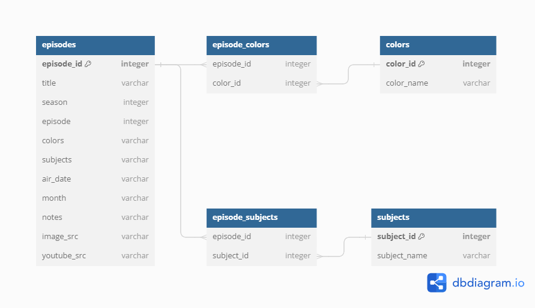

# Atlas School - The Joy of Painting API

In this project we explore the idea of ETL (Extract, Transform, Load), which is the process of taking data from multiple unique sources, modifying them in some way, and then storing them in a centralized database. 

We were given three files containing data about episodes of Bob Ross' "The Joy of Painting". All three files contained different information and were formatted differently.

This projects reads the three files, extracts and transforms the data into a cohesive dataset, loads it into a postgres database, and creates an express server with endpoints to query the database for episodes based on color pallette, subject matter, or month of original television air date.

## Database Structure

## Sections

1. [Files](#Files)
2. [Usage](#Usage)
3. [Resources](#Resources)
__________________________________________________________________________________________________________________________________________

## Files

### - Server -
##### app.js
- Creates the express server
- Defines the routes for retrieving data from the API

### - Data Cleaning -
##### python_clean.py
- Reads data/colors_used.csv, data/subject_matter.csv, & episode_datas.txt, cleans and matches the data and puts it into a new files: clean_data.csv for reference

##### create_database.py
- Creates all the necessary tables to store the data in the database

##### populate_database.py
- Reads data/colors_used.csv, data/subject_matter.csv, & episode_datas.txt, cleans the data and inserts it into the appropriate tables of the database

##### delete_tables.py
- Deletes all the tables of the database for testing purposes

### - SQL -
##### Joy_of_Coding.sql
- Contains the sql commands used to create my data tables

##### sql_commands.py
- Contains the sql commands used to query for data with the endpoints

[Back to top](#Sections)
__________________________________________________________________________________________________________________________________________

## Usage

1. To start the server on port 3000 run:
  `node app.js`
  in the terminal

2. Open the browser with one of the following urls:
- To Query all episodes: `http://localhost:3000/episodes`
- To Query all colors: `http://localhost:3000/colors`
- To Query all subjects: `http://localhost:3000/subjects`
- To Query all episodes painting with a color: `http://localhost:3000/color_name/Bright-Red`
- To Query all episodes painting a certain subject: `http://localhost:3000/subject_name/Circle-Frame`
- To Query all episodes aired a certain month: `http://localhost:3000/month/January`

[Back to top](#Sections)
__________________________________________________________________________________________________________________________________________

## Resources

#### UML diagram & database table creator
[https://dbdiagram.io/d](https://dbdiagram.io/d)

#### SQL Database app
[PostgreSQL](https://www.postgresql.org/)

[Back to top](#Sections)
